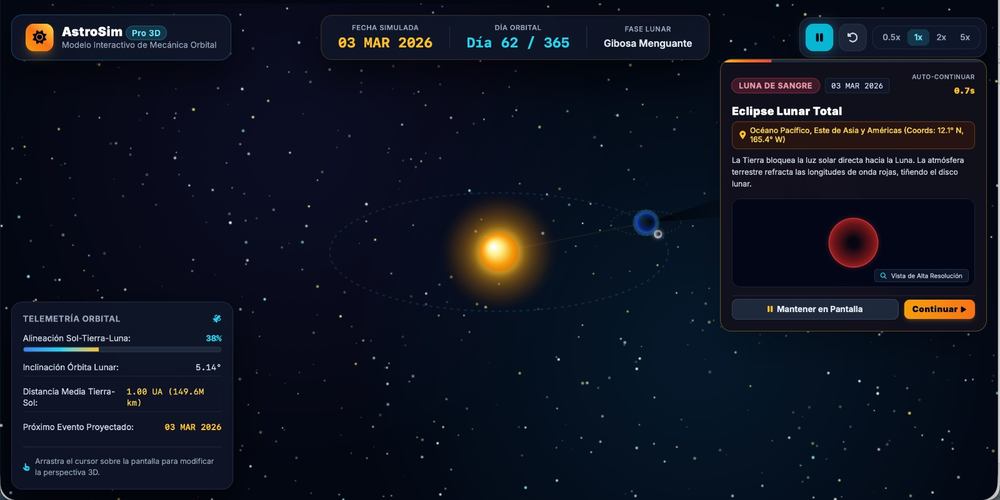

# 🪐 AstroSim Pro: Simulador de Dinámica Orbital & Eclipses en 3D

<div align="center">

  <!-- BOTÓN PRINCIPAL DE LLAMADO A LA ACCIÓN (CTA) -->
  <a href="https://jesus-emmanuel-jimenez-carlos.github.io/simulador-eclipses/" target="_blank">
    
  </a>

  <br/><br/>

  <!-- VISTA PREVIA DEL PROYECTO -->
  <a href="https://jesus-emmanuel-jimenez-carlos.github.io/simulador-eclipses/" target="_blank">
    
  </a>

  <p><sub>🌌 <i>Haz clic en la imagen o en el botón superior para iniciar la experiencia interactiva en tiempo real.</i></sub></p>

  <br/>

  <!-- BADGES DE TECNOLOGÍA Y ESTADO -->
  <a href="https://jesus-emmanuel-jimenez-carlos.github.io/simulador-eclipses/">
    
  </a>
  <a href="https://developer.mozilla.org/es/docs/Web/API/Canvas_API">
    
  </a>
  <a href="#licencia">
    
  </a>

</div>

---

## 🌟 Descripción General

**AstroSim Pro** es una plataforma de simulación interactiva diseñada para modelar la mecánica orbital del sistema Tierra-Luna-Sol y visualizar con precisión matemática los eventos de sizigia que desencadenan los **eclipses solares y lunares** (con enfoque especial en los eventos astronómicos de 2026).

Desarrollado con tecnologías web puras sin dependencias pesadas de motores 3D externos, combina el cálculo dinámico de conos de umbra/penumbra con gráficos vectoriales acelerados por hardware en tiempo real.

---

## ✨ Características Principales

* **🕹️ Motor de Mecánica Orbital en Tiempo Real:** Control total sobre la velocidad del tiempo (0.5x a 5x) y simulación pausables en puntos clave de alineación.
* **🌑 Proyección de Conos de Umbra y Penumbra:** Representación gráfica exacta de las sombras celestes proyectadas en el espacio sideral.
* **📍 Telemetría Geográfica & Coordenadas:** Identificación de ubicaciones óptimas de observación y porcentaje de cobertura durante la totalidad.
* **🎛️ Modos de Inmersión Visual:** Conmutación rápida entre vista global orbital y vista perspectiva desde la superficie terrestre.
* **⚡ Rendimiento Ultra-optimizado:** Carga instantánea en navegadores de escritorio y móviles sin librerías pesadas (0.01s TTI).

---

## 🛠️ Tecnologías Utilizadas

| Componente | Tecnología | Descripción |
| :--- | :--- | :--- |
| **Frontend UI** | HTML5 / Tailwind CSS | Interfaz oscura de grado aeroespacial con paneles flotantes translúcidos |
| **Graphics Engine** | HTML5 Canvas API (2D/Pseudografo 3D) | Renderizado de alta frecuencia a 60 FPS con proyección matemática personalizada |
| **Logic Core** | JavaScript (ES6+) | Ecuaciones matemáticas de geometría orbital y simulación temporal |
| **Deployment** | GitHub Pages | Alojamiento en la nube de alta velocidad con SSL activado |

---

## 🚀 Cómo Ejecutar Localmente

No se requieren instalaciones complejas de `node_modules` ni servidores de desarrollo:

1. Clona el repositorio:
   ```bash
   git clone https://github.com/Jesus-Emmanuel-Jimenez-Carlos/simulador-eclipses.git
   ```
2. Navega al directorio del proyecto:
   ```bash
   cd simulador-eclipses
   ```
3. Abre el archivo `index.html` en cualquier navegador moderno de tu preferencia.


---

## 📄 Licencia

Este proyecto se encuentra bajo la Licencia **MIT**. Puedes consultar el archivo `LICENSE` para más información sobre el uso libre y comercial.

<div align="center">
  <sub>Desarrollado con ❤️ por <b>Jesus Emmanuel Jimenez Carlos</b></sub>
</div>
